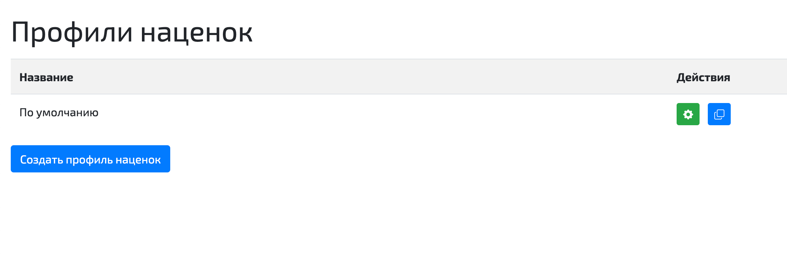
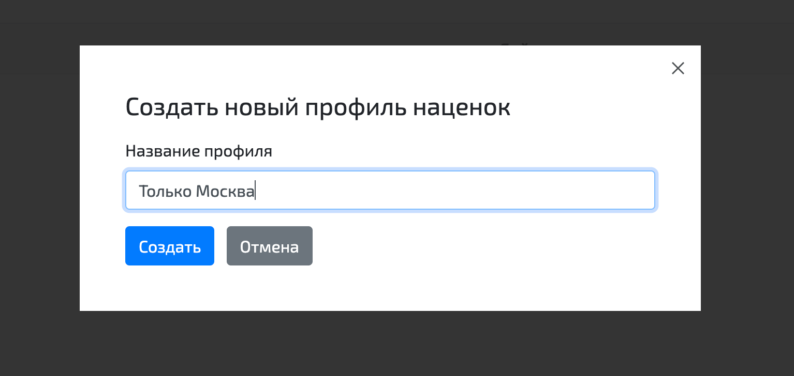
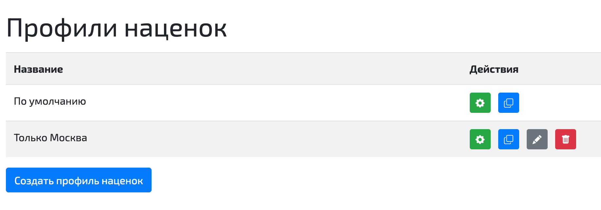
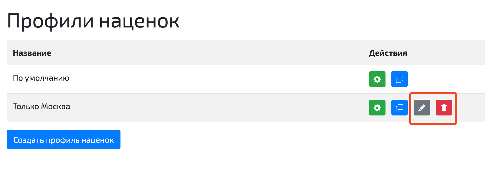
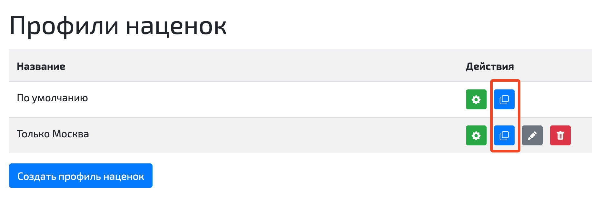
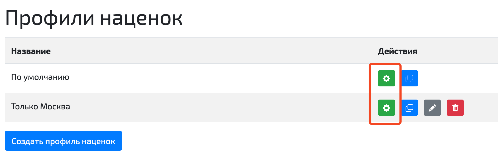
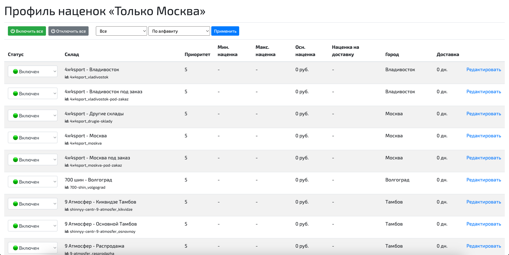
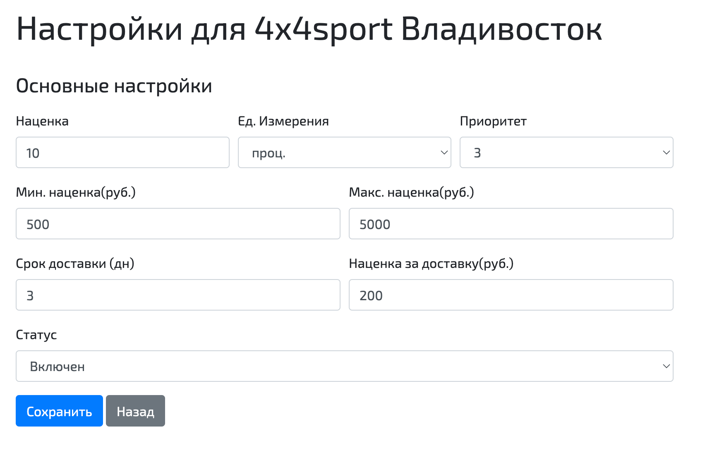
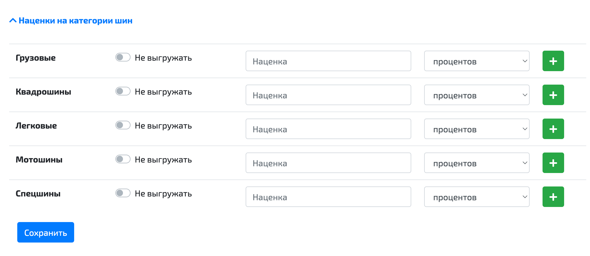

# 🔧 Профили наценок

Профиль наценок — это сохранённый набор настроек, связанных со складами, который можно применять к выгрузке. Профили позволяют быстро переключаться между различными конфигурациями, не настраивая каждый раз параметры складов вручную.

Например, в одном профиле могут быть отключены определённые склады, а в другом — включены. Это удобно, когда для разных выгрузок требуются разные условия. Вы просто выбираете нужный профиль, и все связанные настройки автоматически применяются.

При регистрации в системе у каждого пользователя есть один профиль, который называется "По умолчанию". Этот профиль нельзя переименовать или удалить. 

---

## 📋 Управление профилями наценок

Чтобы посмотреть список профилей, перейдите в верхнем меню в раздел "Настройки → Профили наценок":

Чтобы создать новый профиль, нажмите кнопку "Создать профиль наценок". Система попросит ввести название нового профиля:

После создания профиль появится в списке:

Профиль, созданный вручную, можно удалить или отредактировать его название:

Новый профиль можно создать также, склонировав другой профиль. При этом в новый профиль будут скопированы все настройки старого профиля:

---

## ⚙️ Настройка профиля

Чтобы отредактировать настройки складов в конкретном профиле, нажмите на кнопку с шестерёнкой:

После нажатия кнопки вы попадёте на страницу со списком всех настроек складов в рамках данного профиля. По умолчанию все склады включены:

---

## 📝 Параметры настройки складов

Перейдя в настройки каждого склада, вы сможете настроить следующие параметры:

| Параметр | Описание |
|----------|----------|
| **Наценка** | Числовое поле, в которое записывается размер наценки для товаров на данном складе. Наценка может измеряться в процентах или рублях. |
| **Ед. измерения** | Единицы измерения наценки на данном складе (проценты или рубли). |
| **Мин. наценка** | Минимальная наценка для данного склада. Если основная наценка оказалась меньше минимальной, для расчета розничной цены будет использована минимальная наценка. Если минимальная наценка не ограничена, поле оставляют пустым. |
| **Макс. наценка** | Максимальная наценка для данного склада. Если основная наценка оказалась больше максимальной, для расчета розничной цены будет использована максимальная наценка. Если максимальная наценка не ограничена, поле оставляют пустым. |
| **Приоритет** | Используется для определения лучшего предложения в процессе выгрузки остатков. Значения от 0 до 5. Чем меньше значение, тем выше приоритет склада. Предложения со складов с приоритетом 0 выгружаются в первую очередь (если в настройках выгрузки используется объединение по пользовательскому приоритету). |
| **Срок доставки** | Количество дней, за которое доставляются товары с данного склада. Если значение 0, такие товары будут помечены в интерфейсе подбора как "в наличии". |
| **Наценка за доставку** | Фиксированная сумма в рублях, которая всегда прибавляется к розничной цене товаров на данном складе, независимо от значений других наценок. Если наценка за доставку не требуется, поле можно оставить пустым. |
| **Статус** | Определяет видимость предложений со склада. |

### Статусы складов

Каждый склад может находиться в одном из трёх статусов:

* **Включен** — предложения с этого склада попадают в личный кабинет пользователя и в файл выгрузки.
* **Отслеживается** — предложения с этого склада попадают только в личный кабинет и не попадают в файл выгрузки. В личном кабинете строки этих складов выводятся в конце списка и помечены желтым цветом.
* **Выключен** — предложения с этого склада не попадают ни в личный кабинет, ни в выгрузку.

---

## 🏷️ Категории и бренды

В настройках каждого склада можно также задать конкретные наценки для различных категорий товаров или брендов (или отключить их выгрузку с этого склада):

