# 🔧 Профили наценок

Профиль наценок — это сохранённый набор настроек, связанных со складами, который можно применять к выгрузке. Профили позволяют быстро переключаться между различными конфигурациями, не настраивая каждый раз параметры складов вручную.

Например, в одном профиле могут быть отключены определённые склады, а в другом — включены. Это удобно, когда для разных выгрузок требуются разные условия. Вы просто выбираете нужный профиль, и все связанные настройки автоматически применяются.

При регистрации в системе у каждого пользователя есть один профиль, который называется "По умолчанию". Этот профиль нельзя переименовать или удалить.

---

## 📋 Управление профилями наценок

Чтобы посмотреть список профилей, перейдите в верхнем меню в раздел "Настройки → Профили наценок":

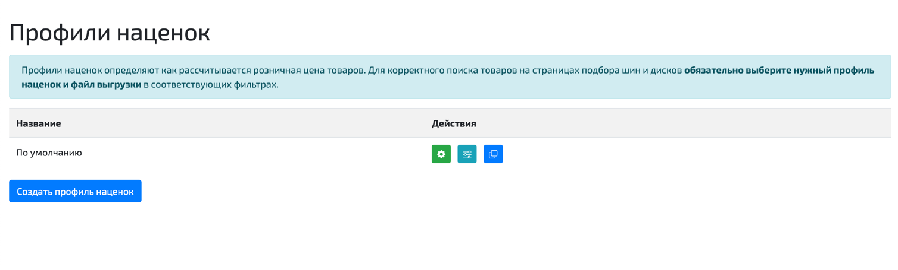

Чтобы создать новый профиль, нажмите кнопку "Создать профиль наценок". Система попросит ввести название нового профиля:

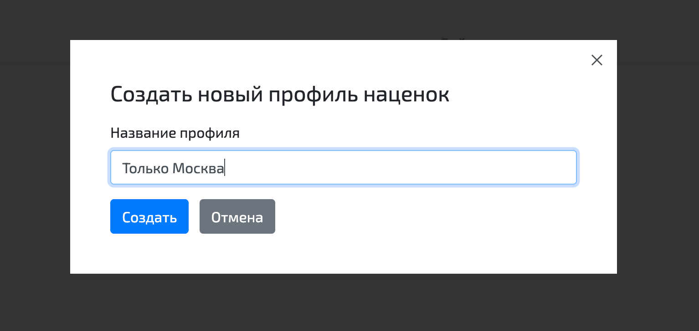

После создания профиль появится в списке:

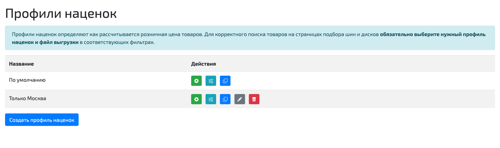

Профиль, созданный вручную, можно удалить или отредактировать его название:

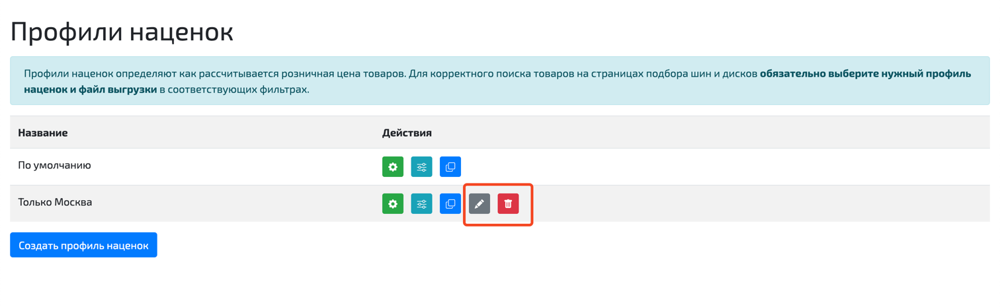

В списке профилей доступны две отдельные кнопки:

* **Настроить склады** — открывает список складов внутри выбранного профиля.
* **Настройки профиля** — открывает общие настройки профиля, которые можно применить сразу ко всем складам.

Новый профиль можно создать также, склонировав другой профиль. При этом в новый профиль будут скопированы все настройки старого профиля:

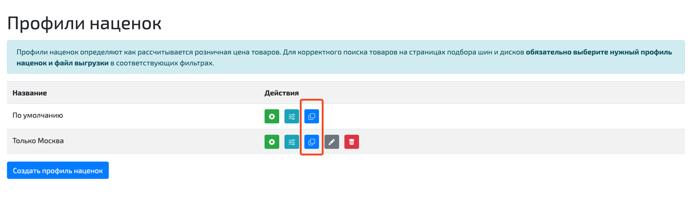

---

## ⚙️ Настройка профиля

Чтобы отредактировать настройки складов в конкретном профиле, нажмите на кнопку с шестерёнкой:

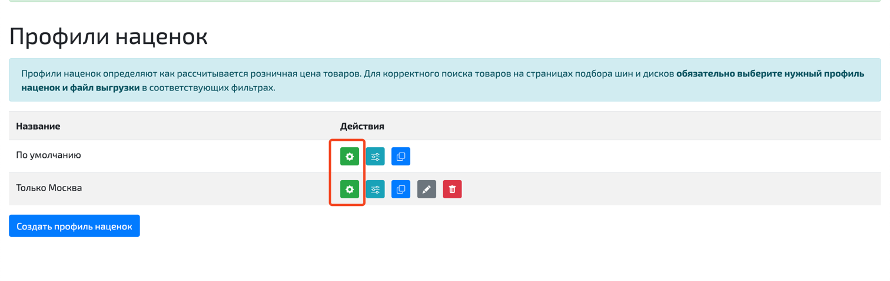

После нажатия кнопки вы попадёте на страницу со списком всех настроек складов в рамках данного профиля. По умолчанию все склады включены:

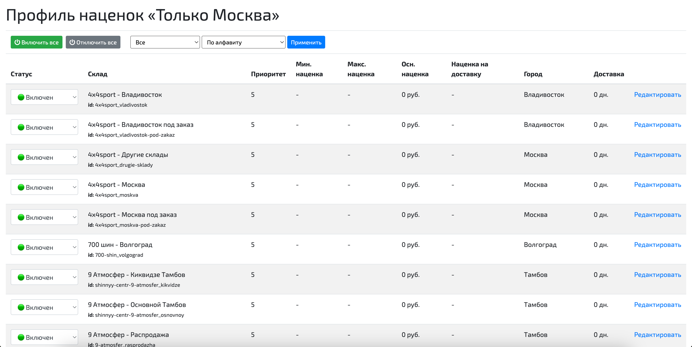

На странице складов также доступна кнопка **Настройки профиля**. Она открывает отдельный экран, где можно задать общие параметры наценок для всего профиля, а затем при необходимости оставить индивидуальные исключения только для отдельных складов.

---

## 📝 Параметры настройки складов

Перейдя в настройки каждого склада, вы сможете настроить следующие параметры:

| Параметр | Описание |
|----------|----------|
| **Наценка** | Числовое поле, в которое записывается размер наценки для товаров на данном складе. Наценка может измеряться в процентах или рублях. |
| **Ед. измерения** | Единицы измерения наценки на данном складе (проценты или рубли). |
| **Мин. наценка** | Минимальная наценка для данного склада. Если основная наценка оказалась меньше минимальной, для расчета розничной цены будет использована минимальная наценка. Если минимальная наценка не ограничена, поле оставляют пустым. |
| **Макс. наценка** | Максимальная наценка для данного склада. Если основная наценка оказалась больше максимальной, для расчета розничной цены будет использована максимальная наценка. Если максимальная наценка не ограничена, поле оставляют пустым. |
| **Приоритет** | Используется для определения лучшего предложения в процессе выгрузки остатков. Значения от 0 до 5. Чем меньше значение, тем выше приоритет склада. Предложения со складов с приоритетом 0 выгружаются в первую очередь (если в настройках выгрузки используется объединение по пользовательскому приоритету). |
| **Срок доставки** | Количество дней, за которое доставляются товары с данного склада. Если значение 0, такие товары будут помечены в интерфейсе подбора как "в наличии". |
| **Наценка за доставку** | Фиксированная сумма в рублях, которая всегда прибавляется к розничной цене товаров на данном складе, независимо от значений других наценок. Если наценка за доставку не требуется, поле можно оставить пустым. |
| **Статус** | Определяет видимость предложений со склада. |

### Статусы складов

Каждый склад может находиться в одном из трёх статусов:

* **Включен** — предложения с этого склада попадают в личный кабинет пользователя и в файл выгрузки.
* **Отслеживается** — предложения с этого склада попадают только в личный кабинет и не попадают в файл выгрузки. В личном кабинете строки этих складов выводятся в конце списка и помечены желтым цветом.
* **Выключен** — предложения с этого склада не попадают ни в личный кабинет, ни в выгрузку.

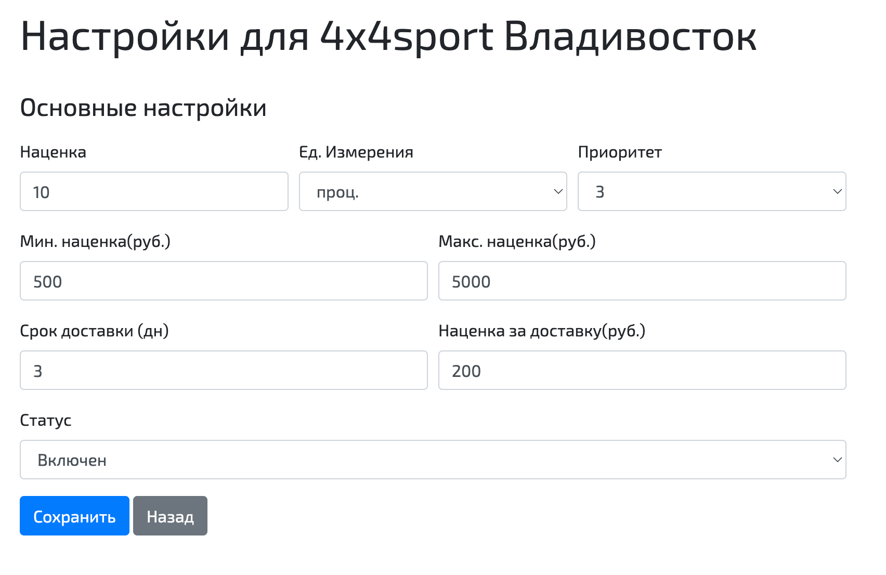

---

## 🏷️ Категории и бренды

В настройках каждого склада можно также задать конкретные наценки для различных категорий товаров или брендов (или отключить их выгрузку с этого склада):

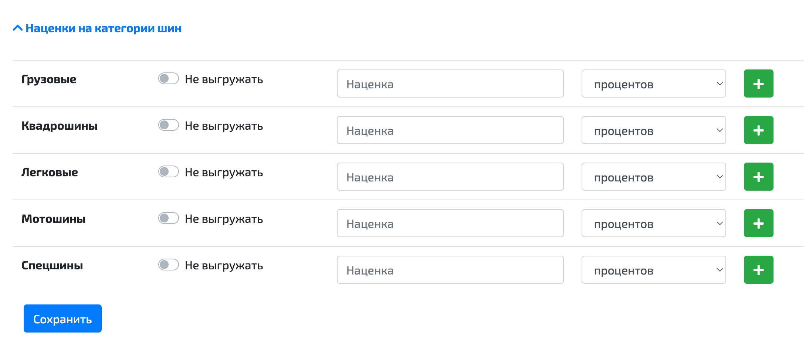

---

## 📌 Общие настройки для всех складов в профиле

В профиле доступны общие настройки, которые позволяют один раз задать базовые параметры сразу для всех складов.

Чтобы открыть эти настройки:

* Перейдите в раздел **Настройки → Профили наценок**.
* Нажмите кнопку **Настройки профиля** рядом с нужным профилем.

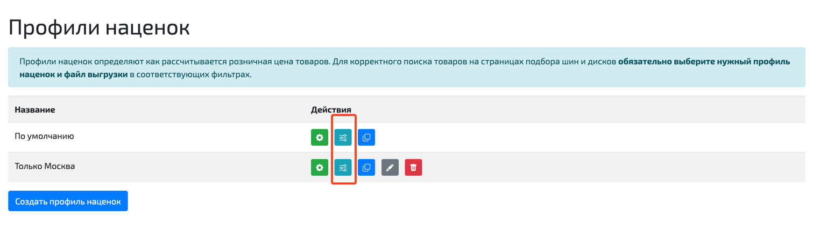

На странице настроек профиля можно задать:

* **Наценку по умолчанию** — основную наценку для всех складов профиля.
* **Единицы измерения** — проценты или рубли для общей наценки.
* **Мин. наценку по умолчанию** — нижнее ограничение наценки в рублях для всех складов.
* **Макс. наценку по умолчанию** — верхнее ограничение наценки в рублях для всех складов.
* **Наценку на доставку по умолчанию** — фиксированную сумму в рублях, которая добавляется к цене для всех складов.

Как это работает:

* Общие настройки профиля применяются ко всем складам этого профиля, если у конкретного склада соответствующее поле не заполнено вручную.
* Если у склада задано собственное значение, оно имеет приоритет над общим значением профиля.
* Если в профиле используются **правила наценок**, то значения из правила имеют приоритет над настройками конкретного склада и над общими настройками профиля.

Рекомендуемый порядок настройки:

* Сначала задайте общие настройки профиля как базовые значения для всех складов.
* Затем откройте только те склады, для которых нужны индивидуальные исключения.
* При необходимости добавьте **правила наценок**, если наценка должна зависеть от параметров товара, бренда или других условий.

Дополнительно на этой же странице можно настроить **сроки доставки по городам** для складов, у которых указан город.

## 📐 Правила наценок

На странице **Настройки профиля** можно также создать **правила наценок**.

Правило наценки - это отдельная настройка, которая позволяет автоматически применять нужную наценку только в тех случаях, когда товар подходит под заданные условия.

Проще говоря:

* вы задаёте одно или несколько условий;
* указываете, какую наценку нужно применить, если эти условия выполнены;
* система использует это правило только для подходящих товаров.

Что можно задать в правиле:

* основную наценку;
* единицы измерения наценки;
* минимальную наценку;
* максимальную наценку;
* наценку на доставку.

Например, правило на изображении ниже можно прочитать так "Для всех летних шин 
дороже 10000₽ установить наценку 15%, но не менее 1000₽ и не более 5000 ₽. 
Дополнительно добавить 500 ₽ за доставку."

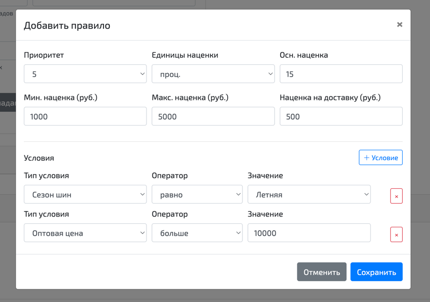

Как правило применяется:

* внутри одного правила должны выполняться **все** указанные условия;
* если правило подошло, его значения используются для расчёта цены;
* правила удобно применять для отдельных групп товаров, брендов или других специальных случаев, когда общих настроек профиля недостаточно.

Если специальных условий нет, достаточно использовать только общие настройки профиля и индивидуальные настройки отдельных складов.

Более подробно о том, как рассчитывается наценка, можно прочитать [здесь](rules.md).
